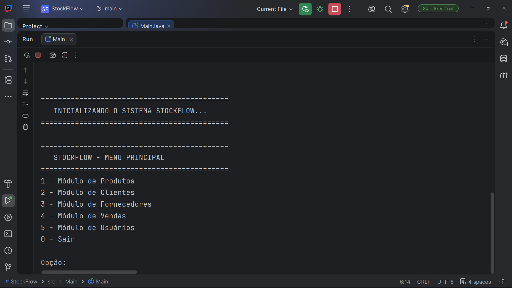
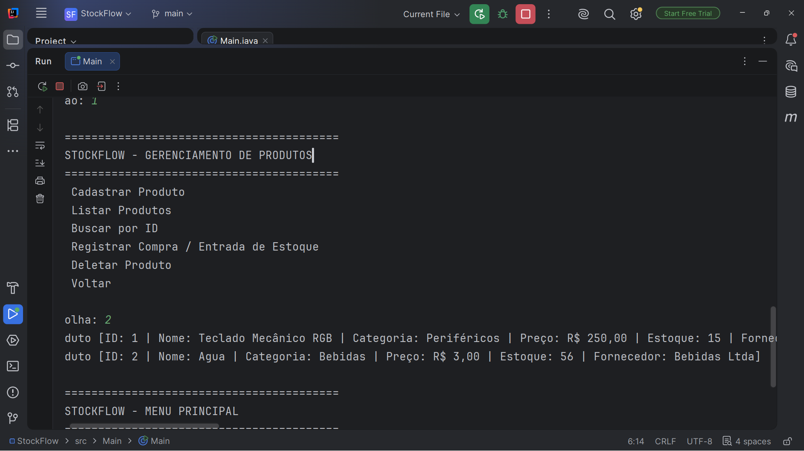

# 📦 StockFlow - Sistema de Gestão de Estoque e Vendas

[](https://www.oracle.com/java/)
[](https://maven.apache.org/)
[](https://www.mysql.com/)
[](LICENSE)

O **StockFlow** é um sistema completo de gerenciamento de estoque e controle de vendas via terminal (CLI). Desenvolvido como projeto acadêmico no **Senac** e expandido como projeto de portfólio pessoal, a aplicação utiliza arquitetura em camadas, conexão direta com banco de dados MySQL via **JDBC** e gerenciamento de dependências com **Maven**.

---

## 📸 Demonstração do Sistema

> 💡 *Espaço reservado para capturas de tela/GIFs do sistema rodando no terminal.*

| Menu Principal | Listagem de Produtos |
| :---: | :---: |
|  |  |

---

## 🚀 Funcionalidades Atuais

- [x] **Gestão de Produtos:** Cadastro, listagem, atualização de preços e controle de estoque.
- [x] **Gestão de Clientes e Fornecedores:** Controle completo de cadastros.
- [x] **Gestão de Usuários:** Cadastro de operadores e administradores para controle do sistema.
- [x] **Registro de Vendas:** Vínculo de produtos, clientes e vendedores em transações registradas no banco.
- [x] **Persistência Relacional:** Banco de dados MySQL modelado com relacionamentos e integridade referencial.

---

## 🗺️ Roadmap (Próximas Melhorias)

Como parte da evolução contínua do projeto, os próximos passos incluem:

- [ ] **Baixa Automática de Estoque:** Atualização automática do saldo de produtos ao confirmar uma venda.
- [ ] **Validação Rigorosa de Dados:** Algoritmos para verificação de CPF e CNPJ válidos.
- [ ] **Relatórios de Vendas:** Exportação de históricos de movimentação financeira.
- [ ] **Refatoração com Padrão DAO/DTO:** Melhoria na separação de responsabilidades da camada de dados.

---

## 🛠️ Tecnologias Utilizadas

- **Linguagem:** Java 17+
- **Gerenciador de Dependências:** Apache Maven
- **Banco de Dados:** MySQL 8.x
- **Driver de Conexão:** MySQL Connector/J (`com.mysql.cj.jdbc.Driver`)
- **IDE:** IntelliJ IDEA

---

## 📁 Estrutura do Projeto

```text
StockFlow/
 ├── src/
 │    ├── DataBase/      # ConnectionFactory e Script SQL
 │    ├── Model/         # Entidades de domínio (Produto, Cliente, Venda, etc.)
 │    ├── Repository/    # Camada de acesso ao banco de dados
 │    ├── Service/       # Regras de negócio da aplicação
 │    ├── Util/          # Manipulação do console e leituras de teclado
 │    └── Main/          # Ponto de entrada da aplicação (Main.java)
 ├── pom.xml             # Dependências e configurações do Maven
 └── README.md           # Documentação do projeto
